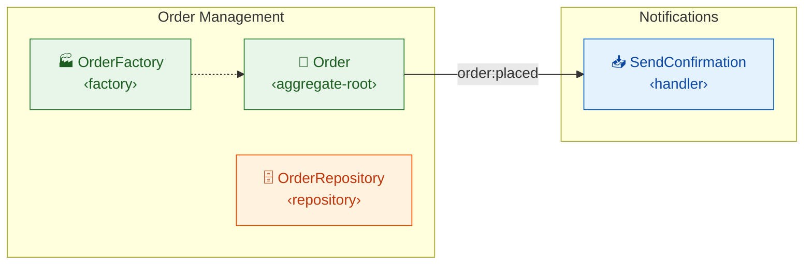

# @funny/domain-map

Parses `@domain` JSDoc annotations from TypeScript source files and generates architecture diagrams (Mermaid flowcharts, sequence diagrams), event catalogs, or structured JSON. Works on any TypeScript codebase — no framework coupling.

## What it does

1. Scans `.ts` files recursively for `/** @domain ... */` JSDoc blocks
2. Extracts DDD metadata: subdomain, type, layer, events, dependencies
3. Builds a `DomainGraph` (nodes grouped by subdomain, with event flow edges)
4. Outputs a **Mermaid flowchart**, **sequence diagram**, **event catalog**, or **JSON** representation

## Installation

Part of the monorepo — no separate install needed:

```bash
bun install
```

## Annotation format

Add `@domain` tags inside JSDoc blocks in any `.ts` file:

```ts
/**
 * @domain subdomain: Order Management
 * @domain subdomain-type: core
 * @domain type: aggregate-root
 * @domain layer: domain
 * @domain emits: order:placed, order:cancelled
 * @domain depends: PriceCalculator
 */
export class Order { ... }
```

### Required tags

| Tag | Description |
|-----|-------------|
| `subdomain` | DDD subdomain name (e.g., "Payment Processing") |
| `type` | DDD concept type (see table below) |
| `layer` | Architectural layer: `domain`, `application`, or `infrastructure` |

### Optional tags

| Tag | Description |
|-----|-------------|
| `subdomain-type` | Strategic classification: `core`, `supporting`, or `generic` |
| `context` | Bounded context name (e.g., "Server", "Client") |
| `event` | For `domain-event` types: the event this interface defines |
| `emits` | Comma-separated list of events this component emits |
| `consumes` | Comma-separated list of events this component consumes |
| `aggregate` | Parent aggregate root name |
| `depends` | Comma-separated domain dependencies (not utility imports) |

### Subdomain types

| Type | Meaning |
|------|---------|
| `core` | The product's differentiator — what makes this system unique |
| `supporting` | Essential but not a differentiator — could theoretically be outsourced |
| `generic` | Standard functionality found in most systems (auth, analytics, etc.) |

### Valid types

**Strategic** (system-level boundaries):

| Type | Meaning |
|------|---------|
| `bounded-context` | Explicit boundary encapsulating a complete domain model |
| `anti-corruption-layer` | Translation layer between bounded contexts |
| `published-language` | Shared format/contract for inter-context communication |
| `context-map` | Orchestration of relationships between bounded contexts |

**Tactical** (domain model building blocks):

| Type | Meaning |
|------|---------|
| `aggregate-root` | Entity that owns a consistency boundary |
| `entity` | Object with identity and lifecycle |
| `value-object` | Immutable object defined by its attributes |
| `domain-event` | Event payload interface/type |
| `domain-service` | Stateless domain logic |
| `app-service` | Application-layer orchestration (use cases) |
| `repository` | Persistence abstraction |
| `factory` | Complex creation logic for aggregates/entities |
| `specification` | Combinable business rule evaluated against objects |
| `policy` | Encapsulated business rule or decision logic |
| `module` | Cohesive grouping of domain concepts (barrel/index) |

**Architectural** (infrastructure patterns):

| Type | Meaning |
|------|---------|
| `port` | Interface/contract (hexagonal architecture) |
| `adapter` | Implementation of a port |
| `event-bus` | Event pub/sub infrastructure |
| `handler` | Reactive event handler |

## Strategic Design (`domain.yaml`)

Beyond tactical annotations in source files, domain-map supports a **strategic design layer** via a `domain.yaml` file. This captures the DDD concepts that describe the system as a whole — domains, subdomains, bounded contexts, their relationships, and team ownership.

### Creating a `domain.yaml`

Place a `domain.yaml` at your project root. Point editors at the JSON Schema for autocomplete and validation:

```yaml
$schema: "./packages/domain-map/domain-schema.json"
version: "1.0"

domain:
  name: MyApp
  description: A brief description of the system.

subdomains:
  Order Management:
    type: core                         # core | supporting | generic
    bounded-context: OrderMgmt         # PascalCase identifier
    aggregates: [Order, OrderLine]     # Aggregate roots in this BC
    publishes: [order:placed, order:shipped]
    exposes: [createOrder, cancelOrder]

  Notifications:
    type: supporting
    bounded-context: Notifications
    exposes: [sendEmail, sendPush]

shared-kernel:
  name: Shared Kernel
  includes: [Database, EventBus, Logger]

context-map:
  - upstream: OrderMgmt
    downstream: Notifications
    relationship: customer-supplier     # See relationship types below
    upstream-role: supplier
    downstream-role: customer
    description: Order events trigger notification delivery.
    implemented-by:
      - "OrderService -> NotificationHandler"

teams:
  Core:
    owns: [OrderMgmt]
  Platform:
    owns: [Notifications]
```

### Relationship types

| Type | Abbr | Arrow | Description |
|------|------|-------|-------------|
| `customer-supplier` | C/S | `-->` | Downstream needs shape upstream's API evolution |
| `partnership` | Partnership | `<-->` | Both BCs evolve together cooperatively |
| `conformist` | Conformist | `-->` | Downstream conforms to upstream's model as-is |
| `published-language` | PL | `-->` | Communication via a shared published format |
| `anti-corruption-layer` | ACL | `-->` | Downstream wraps upstream with a translation layer |
| `open-host-service` | OHS | `-->` | Upstream exposes a standard protocol for all consumers |
| `shared-kernel` | SK | `<-->` | Both BCs share common code/types |
| `separate-ways` | — | `-.-` | No integration between the BCs |

### Strategic CLI commands

```bash
# Generate a context map diagram (BCs as nodes, relationships as labeled edges)
bun packages/domain-map/src/cli.ts --domain-file domain.yaml --format context-map src/

# Cross-validate YAML against code annotations
bun packages/domain-map/src/cli.ts --domain-file domain.yaml --validate src/

# Enrich the standard mermaid/sequence/catalog with strategic data
bun packages/domain-map/src/cli.ts --domain-file domain.yaml --format mermaid src/
```

### Cross-validation

The `--validate` flag checks consistency between the YAML and the `@domain` annotations in code:

- Subdomains in YAML with no matching annotations
- Subdomains in code not defined in YAML
- Subdomain type mismatches (`core` in YAML vs `supporting` in annotation)
- Events in YAML `publishes` never emitted in code
- Aggregates in YAML without `@domain type: aggregate-root` in code
- Context map referencing undefined bounded contexts
- Teams owning undefined bounded contexts
- Bounded contexts not owned by any team

### Programmatic API (strategic)

```ts
import {
  parseStrategicFile,
  parseStrategicYAML,
  buildEnrichedGraph,
  validateConsistency,
  generateContextMap,
} from '@funny/domain-map';
import type {
  StrategicModel,
  EnrichedDomainGraph,
  ContextRelationship,
  RelationshipType,
  ValidationWarning,
} from '@funny/domain-map';

// Parse the YAML file
const strategic = await parseStrategicFile('domain.yaml');

// Or parse from a string
const strategic2 = parseStrategicYAML(yamlContent);

// Merge tactical annotations with strategic model
const enriched = buildEnrichedGraph(annotations, strategic);

// Cross-validate
const warnings = validateConsistency(graph, strategic);

// Generate context map
const mermaid = generateContextMap(enriched, { direction: 'LR' });
```

## CLI Usage

```bash
# Scan a directory and print Mermaid diagram to stdout
bun packages/domain-map/src/cli.ts src/

# Scan with JSON output
bun packages/domain-map/src/cli.ts --format json src/

# Generate a Markdown event catalog
bun packages/domain-map/src/cli.ts --format catalog src/

# Generate sequence diagrams for a specific event family
bun packages/domain-map/src/cli.ts --format sequence --scenario agent src/

# Write output to a file
bun packages/domain-map/src/cli.ts -o architecture.mmd src/

# Filter by subdomain (repeatable)
bun packages/domain-map/src/cli.ts -d "Order Management" -d "Shipping" src/

# Filter by DDD type (repeatable)
bun packages/domain-map/src/cli.ts -t handler -t domain-service src/

# Show only event flow arrows (hide dependency arrows)
bun packages/domain-map/src/cli.ts --events-only src/

# Change diagram direction (LR or TB)
bun packages/domain-map/src/cli.ts --direction TB src/

# Show event bus as explicit mediator in sequence diagrams
bun packages/domain-map/src/cli.ts --format sequence --show-bus src/
```

### CLI Options

| Option | Short | Description | Default |
|--------|-------|-------------|---------|
| `--output` | `-o` | Write output to file | stdout |
| `--format` | `-f` | Output format: `mermaid`, `json`, `sequence`, `catalog`, or `context-map` | `mermaid` |
| `--subdomain` | `-d` | Filter by subdomain (repeatable) | all |
| `--type` | `-t` | Filter by DDD type (repeatable) | all |
| `--events-only` | | Only show event flow arrows | `false` |
| `--direction` | | Mermaid direction: `LR` or `TB` | `LR` |
| `--scenario` | `-s` | Event family prefix filter for sequence diagrams (e.g., `agent`, `git`) | all |
| `--show-bus` | | Show event bus as explicit mediator in sequence diagrams | `false` |
| `--domain-file` | | Path to strategic `domain.yaml` file | none |
| `--validate` | | Cross-validate YAML against code annotations | `false` |
| `--help` | `-h` | Show help | |

## Output Formats

### Mermaid Flowchart (`--format mermaid`)

Static architecture diagram showing all components grouped by subdomain, with event flow and dependency arrows.

- **Subgraphs** for subdomains
- **Color-coded nodes** by layer: green (domain), blue (application), orange (infrastructure)
- **Icons** per DDD type (e.g., `🔷` aggregate-root, `⚡` domain-event, `🏭` factory)
- **Solid arrows** for event flow (emitter → consumer via shared event name)
- **Dashed arrows** for dependency relationships

Options: `subdomainLevel: true` collapses to one node per subdomain.

### Sequence Diagram (`--format sequence`)

Mermaid sequence diagrams showing temporal event choreography grouped by event family (the colon-prefix, e.g., `agent:*`, `git:*`).

- One diagram section per event family
- Participants ordered: emitters → mixed → pure consumers
- Events sorted temporally (`:started` before `:completed`)
- `--scenario` filters to a single family
- `--show-bus` adds the event bus as an explicit mediator

### Event Catalog (`--format catalog`)

Markdown document listing all events with producer/consumer tables, cross-subdomain detection, and a health check section.

- Tables per event family (agent, git, thread, etc.)
- Cross-subdomain column shows whether an event crosses subdomain boundaries
- Health check: orphan events (emitted, never consumed), dead-letter events (consumed, never emitted), busiest producer/consumer

### Context Map (`--format context-map`)

Strategic view showing bounded contexts as nodes and DDD relationships as labeled edges. Requires `--domain-file`.

- Nodes colored by subdomain type: green (core), blue (supporting), grey (generic), yellow (shared kernel)
- Grouped by team ownership (or by subdomain type if no teams defined)
- Edge labels show relationship abbreviation (C/S, ACL, OHS, PL, Partnership, Conformist, SK)
- Component counts from tactical annotations shown on each BC node

### JSON (`--format json`)

Serialized graph as pretty-printed JSON for programmatic consumption.

## Programmatic API

```ts
import { parseFile, parseDirectory, buildGraph } from '@funny/domain-map';
import { generateMermaid, generateJSON, generateSequence, generateCatalog } from '@funny/domain-map';
```

### `parseFile(filePath, content): DomainAnnotation[]`

Parse a single file's content and return all `@domain` annotation blocks.

```ts
const content = await Bun.file('src/order.ts').text();
const annotations = parseFile('src/order.ts', content);
// [{ subdomain: 'Order Management', subdomainType: 'core', type: 'aggregate-root', layer: 'domain', ... }]
```

### `parseDirectory(dir): Promise<DomainGraph>`

Scan a directory recursively for `.ts` files and build a complete graph.

```ts
const graph = await parseDirectory('src/');
console.log(graph.subdomains.keys()); // ['Order Management', 'Shipping', ...]
console.log(graph.nodes.size);        // 42
console.log(graph.events);            // Set { 'order:placed', 'order:shipped', ... }
```

Skips: `node_modules/`, `dist/`, `*.test.ts`, `*.spec.ts`, `*.stories.ts`, `*.d.ts`.

### `buildGraph(annotations): DomainGraph`

Build a graph from an array of annotations (useful when you've parsed files individually).

```ts
const allAnnotations = [...file1Annotations, ...file2Annotations];
const graph = buildGraph(allAnnotations);
```

### `generateMermaid(graph, options?): string`

Generate a Mermaid flowchart from a `DomainGraph`.

```ts
const mermaid = generateMermaid(graph);
// flowchart LR
//   subgraph sd_Order_Management["Order Management"]
//     Order_Management__Order["🔷 Order\n‹aggregate-root›"]:::domain
//   end
```

Options:

| Option | Type | Default | Description |
|--------|------|---------|-------------|
| `direction` | `'LR' \| 'TB'` | `'LR'` | Diagram direction |
| `eventsOnly` | `boolean` | `false` | Hide dependency arrows |
| `subdomainLevel` | `boolean` | `false` | Collapse to one node per subdomain |

```ts
// Subdomain-level overview (one node per subdomain)
const overview = generateMermaid(graph, { subdomainLevel: true });

// Top-down with events only
const events = generateMermaid(graph, { direction: 'TB', eventsOnly: true });
```

### `generateSequence(graph, options?): string`

Generate Mermaid sequence diagrams showing event choreography.

```ts
const seq = generateSequence(graph);
// sequenceDiagram
//   participant AR as agent-runner
//   AR ->> GH: agent:completed
```

Options:

| Option | Type | Default | Description |
|--------|------|---------|-------------|
| `scenario` | `string` | all families | Filter to a single event family prefix |
| `showBus` | `boolean` | `false` | Show event bus as explicit mediator |

### `generateCatalog(graph, options?): string`

Generate a Markdown event catalog.

```ts
const catalog = generateCatalog(graph);
// # Event Catalog
// > Auto-generated from `@domain` annotations. 16 events across 3 families.
```

Options:

| Option | Type | Default | Description |
|--------|------|---------|-------------|
| `includeHealthCheck` | `boolean` | `true` | Include the health check section |

### `generateJSON(graph): string`

Serialize the graph as pretty-printed JSON.

```ts
const json = generateJSON(graph);
// { "nodes": { ... }, "subdomains": { ... }, "events": [...] }
```

## Example output

### Mermaid Flowchart


```mermaid
flowchart LR
  classDef domain fill:#E8F5E9,stroke:#2E7D32,color:#1B5E20
  classDef application fill:#E3F2FD,stroke:#1565C0,color:#0D47A1
  classDef infrastructure fill:#FFF3E0,stroke:#E65100,color:#BF360C

  subgraph sd_Order_Management["Order Management"]
    Order_Management__Order["🔷 Order\n‹aggregate-root›"]:::domain
    Order_Management__OrderFactory["🏭 OrderFactory\n‹factory›"]:::domain
    Order_Management__OrderRepository["🗄️ OrderRepository\n‹repository›"]:::infrastructure
  end

  subgraph sd_Notifications["Notifications"]
    Notifications__SendConfirmation["📥 SendConfirmation\n‹handler›"]:::application
  end

  Order_Management__Order -- "order:placed" --> Notifications__SendConfirmation
  Order_Management__OrderFactory -.-> Order_Management__Order
```

## Claude Code Skill

This package includes a Claude Code skill (`SKILL.md`) that teaches Claude to automatically analyze TypeScript files and add `@domain` annotations. The skill works on **any** codebase — it discovers subdomains dynamically from the code structure.

### Installing the skill

Copy `SKILL.md` into your project's `.claude/skills/` directory:

```bash
# From your project root
mkdir -p .claude/skills/domain-annotate
cp node_modules/@funny/domain-map/SKILL.md .claude/skills/domain-annotate/SKILL.md
```

Or copy it manually from this package into your Claude Code skills folder:

```
your-project/
  .claude/
    skills/
      domain-annotate/
        SKILL.md        ← copy this file here
```

### Using the skill

Once installed, use it in Claude Code:

```
/domain-annotate src/services/order-service.ts
```

The skill reads the file, infers the DDD role from its structure, imports, and patterns, and adds the appropriate JSDoc block. It identifies all 19 DDD concept types:

- **Strategic:** bounded-context, anti-corruption-layer, published-language, context-map
- **Tactical:** aggregate-root, entity, value-object, domain-event, domain-service, app-service, repository, factory, specification, policy, module
- **Architectural:** port, adapter, event-bus, handler

## Types

All types are exported from the package root:

```ts
import type {
  // Tactical
  DomainAnnotation,  // Single annotation block
  DomainGraph,       // Complete graph (nodes + subdomains + events)
  DomainType,        // Union of all valid DDD types
  DomainLayer,       // 'domain' | 'application' | 'infrastructure'
  SubdomainType,     // 'core' | 'supporting' | 'generic'
  CLIOptions,        // CLI argument structure
  // Strategic
  StrategicModel,        // Parsed domain.yaml
  EnrichedDomainGraph,   // DomainGraph + StrategicModel
  RelationshipType,      // 'customer-supplier' | 'partnership' | ...
  ContextRelationship,   // Single relationship between BCs
  SubdomainDefinition,   // Subdomain entry from YAML
  SharedKernelDefinition,// Shared kernel entry from YAML
  TeamDefinition,        // Team entry from YAML
  ValidationWarning,     // Cross-validation result
} from '@funny/domain-map';

import type {
  MermaidOptions,
  SequenceOptions,
  CatalogOptions,
  ContextMapOptions,
} from '@funny/domain-map';
```
