# @funny/domain-map

Parses `@domain` JSDoc annotations from TypeScript source files and generates architecture diagrams (Mermaid) or structured JSON. Works on any TypeScript codebase — no framework coupling.

## What it does

1. Scans `.ts` files recursively for `/** @domain ... */` JSDoc blocks
2. Extracts DDD metadata: bounded context, type, layer, events, dependencies
3. Builds a `DomainGraph` (nodes grouped by bounded context, with event flow edges)
4. Outputs a **Mermaid flowchart** or **JSON** representation

## Installation

Part of the monorepo — no separate install needed:

```bash
bun install
```

## Annotation format

Add `@domain` tags inside JSDoc blocks in any `.ts` file:

```ts
/**
 * @domain context: Order Management
 * @domain type: aggregate-root
 * @domain layer: domain
 * @domain emits: order:placed, order:cancelled
 * @domain depends: PriceCalculator
 */
export class Order { ... }
```

### Required tags

| Tag | Description |
|-----|-------------|
| `context` | Bounded Context name (e.g., "Payment Processing") |
| `type` | DDD concept type (see table below) |
| `layer` | Architectural layer: `domain`, `application`, or `infrastructure` |

### Optional tags

| Tag | Description |
|-----|-------------|
| `event` | For `domain-event` types: the event this interface defines |
| `emits` | Comma-separated list of events this component emits |
| `consumes` | Comma-separated list of events this component consumes |
| `aggregate` | Parent aggregate root name |
| `depends` | Comma-separated domain dependencies (not utility imports) |

### Valid types

**Strategic** (system-level boundaries):

| Type | Meaning |
|------|---------|
| `bounded-context` | Explicit boundary encapsulating a complete domain model |
| `anti-corruption-layer` | Translation layer between bounded contexts |
| `published-language` | Shared format/contract for inter-context communication |
| `context-map` | Orchestration of relationships between bounded contexts |

**Tactical** (domain model building blocks):

| Type | Meaning |
|------|---------|
| `aggregate-root` | Entity that owns a consistency boundary |
| `entity` | Object with identity and lifecycle |
| `value-object` | Immutable object defined by its attributes |
| `domain-event` | Event payload interface/type |
| `domain-service` | Stateless domain logic |
| `app-service` | Application-layer orchestration (use cases) |
| `repository` | Persistence abstraction |
| `factory` | Complex creation logic for aggregates/entities |
| `specification` | Combinable business rule evaluated against objects |
| `policy` | Encapsulated business rule or decision logic |
| `module` | Cohesive grouping of domain concepts (barrel/index) |

**Architectural** (infrastructure patterns):

| Type | Meaning |
|------|---------|
| `port` | Interface/contract (hexagonal architecture) |
| `adapter` | Implementation of a port |
| `event-bus` | Event pub/sub infrastructure |
| `handler` | Reactive event handler |

## CLI Usage

```bash
# Scan a directory and print Mermaid diagram to stdout
bun packages/domain-map/src/cli.ts src/

# Scan with JSON output
bun packages/domain-map/src/cli.ts --format json src/

# Write output to a file
bun packages/domain-map/src/cli.ts -o architecture.mmd src/

# Filter by bounded context (repeatable)
bun packages/domain-map/src/cli.ts -c "Order Management" -c "Shipping" src/

# Filter by DDD type (repeatable)
bun packages/domain-map/src/cli.ts -t handler -t domain-service src/

# Show only event flow arrows (hide dependency arrows)
bun packages/domain-map/src/cli.ts --events-only src/

# Change diagram direction (LR or TB)
bun packages/domain-map/src/cli.ts --direction TB src/
```

### CLI Options

| Option | Short | Description | Default |
|--------|-------|-------------|---------|
| `--output` | `-o` | Write output to file | stdout |
| `--format` | `-f` | Output format: `mermaid` or `json` | `mermaid` |
| `--context` | `-c` | Filter by bounded context (repeatable) | all |
| `--type` | `-t` | Filter by DDD type (repeatable) | all |
| `--events-only` | | Only show event flow arrows | `false` |
| `--direction` | | Mermaid direction: `LR` or `TB` | `LR` |
| `--help` | `-h` | Show help | |

## Programmatic API

```ts
import { parseFile, parseDirectory, buildGraph } from '@funny/domain-map';
import { generateMermaid, generateJSON } from '@funny/domain-map/generators';
```

### `parseFile(filePath, content): DomainAnnotation[]`

Parse a single file's content and return all `@domain` annotation blocks.

```ts
const content = await Bun.file('src/order.ts').text();
const annotations = parseFile('src/order.ts', content);
// [{ context: 'Order Management', type: 'aggregate-root', layer: 'domain', ... }]
```

### `parseDirectory(dir): Promise<DomainGraph>`

Scan a directory recursively for `.ts` files and build a complete graph.

```ts
const graph = await parseDirectory('src/');
console.log(graph.contexts.keys()); // ['Order Management', 'Shipping', ...]
console.log(graph.nodes.size);      // 42
console.log(graph.events);          // Set { 'order:placed', 'order:shipped', ... }
```

Skips: `node_modules/`, `dist/`, `*.test.ts`, `*.spec.ts`, `*.stories.ts`, `*.d.ts`.

### `buildGraph(annotations): DomainGraph`

Build a graph from an array of annotations (useful when you've parsed files individually).

```ts
const allAnnotations = [...file1Annotations, ...file2Annotations];
const graph = buildGraph(allAnnotations);
```

### `generateMermaid(graph, options?): string`

Generate a Mermaid flowchart from a `DomainGraph`.

```ts
const mermaid = generateMermaid(graph);
// flowchart LR
//   subgraph ctx_Order_Management["Order Management"]
//     Order_Management__Order["🔷 Order\n‹aggregate-root›"]:::domain
//   end
```

Options:

| Option | Type | Default | Description |
|--------|------|---------|-------------|
| `direction` | `'LR' \| 'TB'` | `'LR'` | Diagram direction |
| `eventsOnly` | `boolean` | `false` | Hide dependency arrows |
| `contextLevel` | `boolean` | `false` | Collapse to one node per context |

```ts
// Context-level overview (one node per bounded context)
const overview = generateMermaid(graph, { contextLevel: true });

// Top-down with events only
const events = generateMermaid(graph, { direction: 'TB', eventsOnly: true });
```

### `generateJSON(graph): string`

Serialize the graph as pretty-printed JSON.

```ts
const json = generateJSON(graph);
// { "nodes": { ... }, "contexts": { ... }, "events": [...] }
```

## Mermaid Output

The generated diagram uses:

- **Subgraphs** for bounded contexts
- **Color-coded nodes** by layer: green (domain), blue (application), orange (infrastructure)
- **Icons** per DDD type (e.g., `🔷` aggregate-root, `⚡` domain-event, `🏭` factory)
- **Solid arrows** for event flow (emitter → consumer via shared event name)
- **Dashed arrows** for dependency relationships

### Example output

```mermaid
flowchart LR
  classDef domain fill:#E8F5E9,stroke:#2E7D32,color:#1B5E20
  classDef application fill:#E3F2FD,stroke:#1565C0,color:#0D47A1
  classDef infrastructure fill:#FFF3E0,stroke:#E65100,color:#BF360C

  subgraph ctx_Order_Management["Order Management"]
    Order_Management__Order["🔷 Order\n‹aggregate-root›"]:::domain
    Order_Management__OrderFactory["🏭 OrderFactory\n‹factory›"]:::domain
    Order_Management__OrderRepository["🗄️ OrderRepository\n‹repository›"]:::infrastructure
  end

  subgraph ctx_Notifications["Notifications"]
    Notifications__SendConfirmation["📥 SendConfirmation\n‹handler›"]:::application
  end

  Order_Management__Order -- "order:placed" --> Notifications__SendConfirmation
  Order_Management__OrderFactory -.-> Order_Management__Order
```



## Claude Code Skill

This package includes a Claude Code skill (`SKILL.md`) that teaches Claude to automatically analyze TypeScript files and add `@domain` annotations. The skill works on **any** codebase — it discovers bounded contexts dynamically from the code structure.

### Installing the skill

Copy `SKILL.md` into your project's `.claude/skills/` directory:

```bash
# From your project root
mkdir -p .claude/skills/domain-annotate
cp node_modules/@funny/domain-map/SKILL.md .claude/skills/domain-annotate/SKILL.md
```

Or copy it manually from this package into your Claude Code skills folder:

```
your-project/
  .claude/
    skills/
      domain-annotate/
        SKILL.md        ← copy this file here
```

### Using the skill

Once installed, use it in Claude Code:

```
/domain-annotate src/services/order-service.ts
```

The skill reads the file, infers the DDD role from its structure, imports, and patterns, and adds the appropriate JSDoc block. It identifies all 19 DDD concept types:

- **Strategic:** bounded-context, anti-corruption-layer, published-language, context-map
- **Tactical:** aggregate-root, entity, value-object, domain-event, domain-service, app-service, repository, factory, specification, policy, module
- **Architectural:** port, adapter, event-bus, handler

## Types

All types are exported from the package root:

```ts
import type {
  DomainAnnotation,  // Single annotation block
  DomainGraph,       // Complete graph (nodes + contexts + events)
  DomainType,        // Union of all valid DDD types
  DomainLayer,       // 'domain' | 'application' | 'infrastructure'
  CLIOptions,        // CLI argument structure
} from '@funny/domain-map';

import type { MermaidOptions } from '@funny/domain-map/generators';
```
